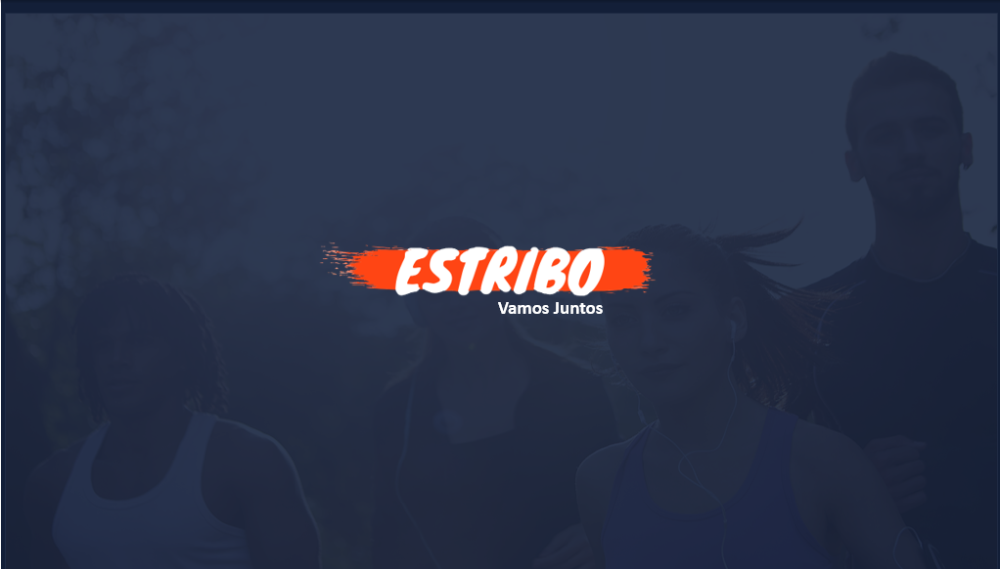

<h1 align="center">Projeto Estribo</h1>

  
  <a href="#-tecnologias">Tecnologias</a>&nbsp;&nbsp;&nbsp;|&nbsp;&nbsp;&nbsp;
  <a href="#-projeto">Projeto</a>&nbsp;&nbsp;&nbsp;|&nbsp;&nbsp;&nbsp;
  <a href="#-layout">Layout</a>&nbsp;&nbsp;&nbsp;|&nbsp;&nbsp;&nbsp;
  <a href="#-Equipe">Equipe</a>

 

  

 

  

## 🚀 Tecnologias

Esse projeto foi desenvolvido com as seguintes tecnologias:

- [ASP.NET](https://dotnet.microsoft.com/apps/aspnet)
- [Bootstrap](https://getbootstrap.com/)
- [MySQL](https://www.mysql.com/)

## 💻 Projeto

O Estribo é um sistema que facilita o praticante de um esporte a achar
outros praticantes, para que possam marcar e organizar
a partida de forma fácil e rápida. 

Crie partidas, participe de torneios, descubra novos lugares e pessoas para 
praticar seu esporte preferido! 💜

## 🔖 Layout

- https://www.behance.net/gallery/110321289/Estribo

## 🥇 Equipe

Back End - Vinícius Barreto –  (https://www.linkedin.com/in/vinicius-barreto-64702b193/)

Front End - Thalles Dias –  (https://github.com/thalesodias)

Design - Isabelly Filgueira –  (https://github.com/IFilgueira)

---

Projeto acadêmico desenvolvido no 4º Semestre do curso ADS ♥
